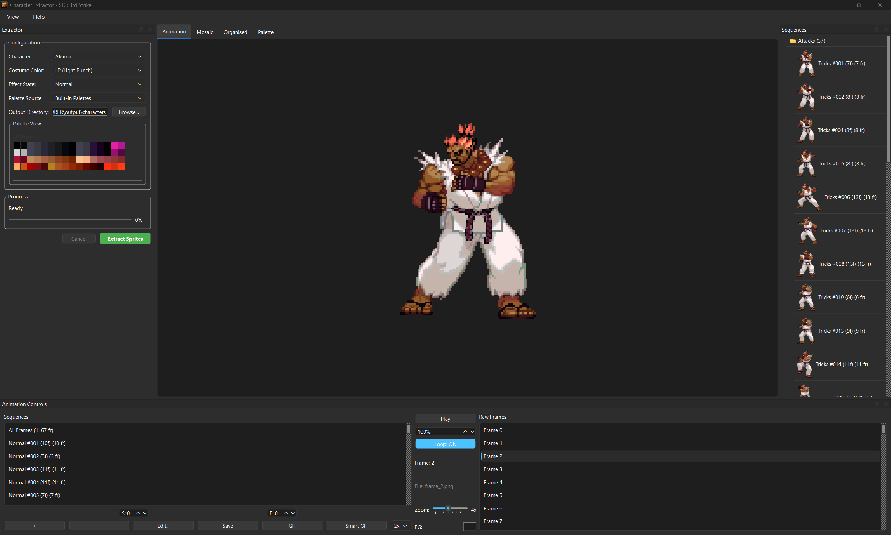
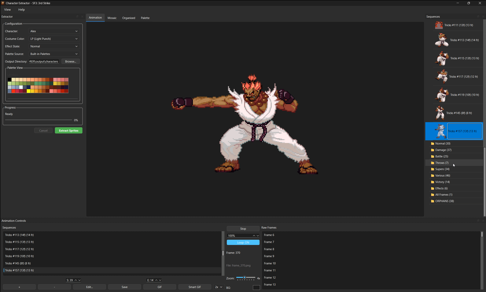
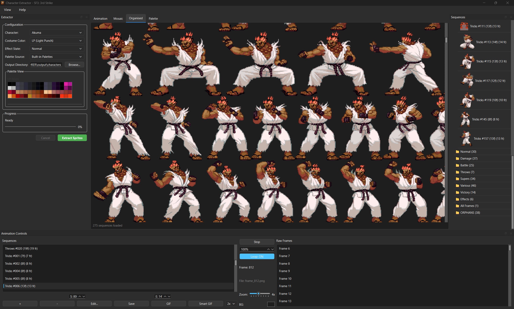

# SF3:3rd Strike Character Extractor

A tool for viewing and extracting character sprites from *Street Fighter III: 3rd Strike* (PS2 version).



## Features

- 🎨 **Palette Editor** — View and switch between costume colors and effect palettes in real time
- 🖼️ **Sprite Viewer** — Browse individual sprites with correct palettes applied
- 🎞️ **Animation Playback** — Play back animation sequences with looping and speed control
- 📋 **Organised View** — See all sprites for a sequence laid out in a grid
- 📦 **Direct AFS Support** — Read directly from `SF33RD.AFS` — no manual extraction needed
- 💾 **Export** — Save sprites, frames, and GIFs

### Animation Playback



### Organised Sprite View



## Quick Start

### Using uv (Recommended)

[uv](https://docs.astral.sh/uv/) is a fast Python package manager that handles dependencies automatically.

1.  Install uv (if not already installed):

    **Windows (PowerShell)**:
    ```powershell
    powershell -ExecutionPolicy ByPass -c "irm https://astral.sh/uv/install.ps1 | iex"
    ```

    **macOS/Linux**:
    ```bash
    curl -LsSf https://astral.sh/uv/install.sh | sh
    ```

2.  Run the Character Extractor — dependencies are installed automatically:

    **Windows**:
    ```bash
    run.bat
    ```

    **macOS/Linux**:
    ```bash
    chmod +x run.sh
    ./run.sh
    ```

### Using pip

1.  Install dependencies:

    ```bash
    pip install .
    ```

2.  Run the tool:

    ```bash
    python run_character_editor.py
    ```

## System Requirements

*   **OS**: Windows, macOS, or Linux
*   **Python**: 3.10+ (3.12 recommended)
*   **Package Manager**: [uv](https://docs.astral.sh/uv/) (recommended) or pip

## AFS Data Source

The tool automatically searches for game assets in this priority order:

<details>
<summary><b>Windows</b></summary>

1. `%APPDATA%\CrowdedStreet\3SX\resources\SF33RD.AFS`
2. `{cwd}\SF33RD.AFS`
3. `%APPDATA%\CrowdedStreet\3SX\resources\afsextracted\`
4. `{cwd}\afsextracted\`

</details>

<details>
<summary><b>macOS</b></summary>

1. `~/Library/Application Support/CrowdedStreet/3SX/resources/SF33RD.AFS`
2. `{cwd}/SF33RD.AFS`
3. `~/Library/Application Support/CrowdedStreet/3SX/resources/afsextracted/`
4. `{cwd}/afsextracted/`

</details>

<details>
<summary><b>Linux</b></summary>

1. `~/.local/share/CrowdedStreet/3SX/resources/SF33RD.AFS`
2. `{cwd}/SF33RD.AFS`
3. `~/.local/share/CrowdedStreet/3SX/resources/afsextracted/`
4. `{cwd}/afsextracted/`

</details>

Place your `SF33RD.AFS` file or extracted files in one of these locations.

## Project Structure

```
sf33rd/              Core Python package
  core/              Data models, AFS archive reader, utilities
  parsers/           Texture unpacker, animation parser
  lib/               Palette, swizzle, image, layout libraries
SF3FSPLORERGUI/      GUI application (PyQt6)
run_character_editor.py   Launcher
```

## Troubleshooting

| Problem | Solution |
|---------|----------|
| **No assets found** | Place `SF33RD.AFS` in one of the data source locations above |
| **Permission errors** | Ensure read/write access to the output directory |
| **Missing dependencies** | Run `uv sync` or `pip install .` |
| **Blank sprites** | Check that the correct palette source is selected |

## Disclaimer

This tool is provided "as is" without any warranties or guarantees. You are solely responsible for ensuring your environment is properly configured and for any consequences resulting from the use of this tool. Always backup important data before use.

## License

This tool is based on research and reverse engineering for the Street Fighter III community. Please respect game licensing and use this tool only with legally owned game files.
